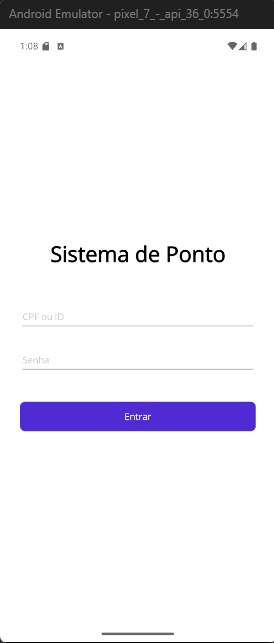
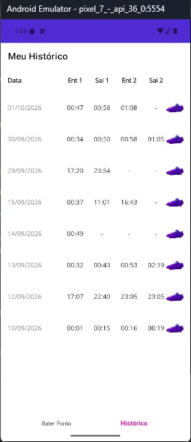
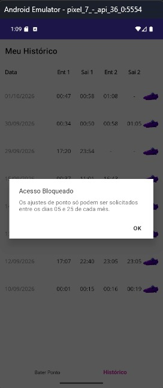
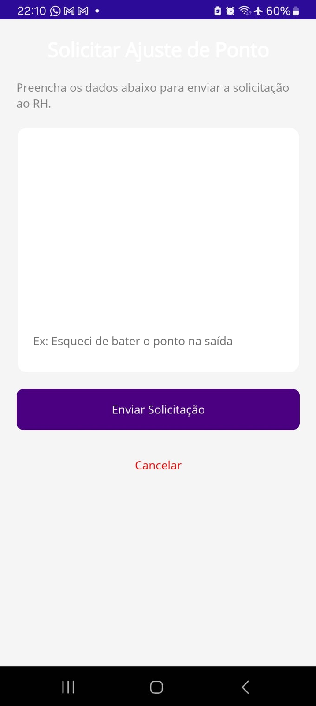
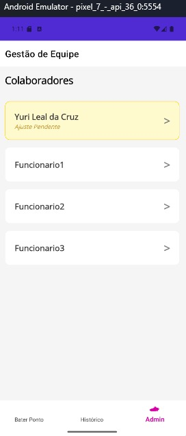
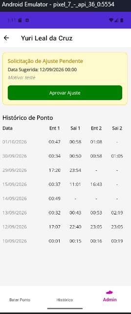

# ⏱️ Sistema de Controle de Ponto Mobile (.NET MAUI)

Um aplicativo mobile completo desenvolvido em **.NET MAUI (C#)** focado na gestão de registros de ponto eletrônico e controle de equipe em tempo real. O sistema integra-se a uma API REST para gerenciamento de registros, solicitações de ajuste com regras de negócio e aprovação administrativa.

---

## 📱 Screenshots do Aplicativo

| Login | Registro de Ponto | Histórico de Registros |
| :---: | :---: | :---: |
|  |  |  |

| Validação de Regra de Negócio | Solicitação de Ajuste | Painel Admin (Status Pendente) | Detalhes & Aprovação |
| :---: | :---: | :---: | :---: |
|  |  |  |  |

---

## ✨ Funcionalidades Principais

### 👤 Visão do Colaborador
* **Autenticação:** Login por CPF/ID e senha.
* **Registro de Ponto:** Marcação rápida de entradas e saídas com confirmação visual do horário.
* **Histórico Detalhado:** Agrupamento automático dos horários (Entrada 1, Saída 1, Entrada 2, Saída 2) organizados por data.
* **Solicitação de Ajuste de Ponto:** Envio de justificativas ao RH para ajuste de horários retroativos.
* **Regras de Negócio em Tempo Real:** Bloqueio automático de solicitações de ajuste fora da janela permitida (ex: liberado apenas entre os dias 05 e 25 de cada mês).

### 🛡️ Visão do Administrador / Gestor
* **Gestão de Equipe:** Listagem de colaboradores em formato de cards interativos.
* **Sinalização Visual de Pendências:** Destaque em cor amarela (*Ajuste Pendente*) para colaboradores que possuem solicitações a serem analisadas.
* **Análise e Aprovação:** Visualização completa da justificativa, data sugerida e histórico de pontos do funcionário com botão de aprovação em um clique.

---

## 🛠️ Tecnologias Utilizadas

* **Framework Mobile:** [.NET MAUI (.NET 10)](https://dotnet.microsoft.com/en-us/apps/maui)
* **Linguagem:** C# / XAML
* **Comunicação REST:** `HttpClient` + `System.Net.Http.Json`
* **Arquitetura & Design:** XAML Controls, Data Binding, FlexLayout/Grid UI

---

## 🚀 Como Executar o Projeto

### Pré-requisitos
* [.NET 10 SDK](https://dotnet.microsoft.com/download)
* Carga de trabalho (workload) **MAUI** instalada (`dotnet workload install maui`)
* Visual Studio 2022 / VS Code com extensão C# e MAUI
* Emulador Android ou Dispositivo Físico configurado em modo desenvolvedor

### Passos
1. **Clonar o repositório:**
   ```bash
   git clone [https://github.com/yurilealdacruz/ponto-system.git](https://github.com/yurilealdacruz/ponto-system.git)
   cd ponto-system